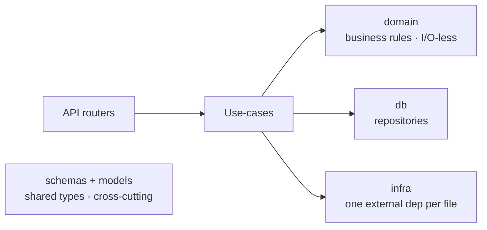

# CLAUDE.md

This file provides guidance to Claude Code (claude.ai/code) when working with code in this repository.

## Project Overview

MCR (Meeting Capture & Report) — a microservices platform that captures meeting audio, transcribes it, and generates reports using LLMs. Documentation and commits are in French; code is in English.

## Commands

### Full Stack

```bash
make start                      # Start all services (docker compose --watch)
make start service=mcr-frontend # Start a single service
make stop                       # Stop all services
make restart service=...        # Restart specific service
make rebuild service=...        # Rebuild and restart a service
```

### Per-Package (run from package directory, e.g. `cd mcr-core`)

```bash
make pre-commit     # Run format + type-check + lint + test (all at once)
make test           # uv run pytest .
make type-check     # uv run mypy -p <package>
make lint           # uv run ruff check
make format         # uv run ruff format && ruff check --select I . --fix
make deps-check     # uv run deptry -v .
make test-coverage  # pytest with --cov
```

### Single test

```bash
cd mcr-core && uv run pytest tests/unit/test_foo.py::test_bar -v
```

### Database Migrations (mcr-core only)

```bash
make db-migration m='add users table'   # Create migration
make db-upgrade                          # Apply migrations
make db-downgrade                        # Revert last migration
```

### Frontend (`cd mcr-frontend`)

```bash
pnpm dev            # Dev server
pnpm build          # Production build
pnpm test:unit      # Vitest
pnpm lint           # ESLint
```

### Root-Level Quality Checks (all Python packages)

```bash
make type-check     # mypy across all packages
make lint           # ruff across all packages
make format         # ruff format across all packages
make pre-commit     # all three above
make coverage       # test coverage across all packages
```

## Architecture

```
Frontend (Vue 3) → mcr-gateway (FastAPI, auth/routing) → mcr-core (FastAPI, CRUD + Celery tasks)
                                                        → mcr-generation (Celery worker, LLM reports)

mcr-capture-worker (Playwright bot) — joins meetings, records audio, uploads to S3, reports to mcr-core
```

- **mcr-gateway**: Auth via Keycloak, proxies requests to backend services
- **mcr-core**: Meeting CRUD, transcription scheduling, Alembic migrations. Dual role: FastAPI API + Celery worker
- **mcr-generation**: Celery-only worker for LLM report generation (LangChain, OpenAI, Instructor)
- **mcr-capture-worker**: Playwright bot that joins video meetings (Visio, Webex, Webconf), records audio, uploads to Minio/S3
- **mcr-frontend**: Vue 3 + TypeScript, DSFR design system, Pinia state, TanStack Query

### Package Directory Structure

```
mcr-core/mcr_meeting/app/
├── api/            # FastAPI routers — thin: validate input → call service → return response
├── services/       # Business logic lives here
├── db/             # Repositories — all SQLAlchemy queries go here
├── models/         # SQLAlchemy ORM models
├── schemas/        # Pydantic request/response schemas
├── configs/        # Settings via pydantic-settings
├── client/         # External service clients (SMTP, S3, etc.)
├── orchestrators/  # Cross-service coordination
├── utils/          # Shared helpers
└── exceptions/     # Custom exception classes

mcr-gateway/mcr_gateway/app/
├── api/            # Routers (proxy to backend services)
├── services/       # Auth logic, request forwarding
├── configs/        # Gateway settings
└── schemas/        # Gateway-specific schemas

mcr-generation/mcr_generation/app/
├── services/       # LLM report generation logic
├── configs/        # Generation settings
├── schemas/        # Generation schemas
└── utils/          # Prompt templates, helpers
```

### Infrastructure

- **PostgreSQL 17** — main database (port 5433)
- **Redis** — Celery broker + cache
- **Minio** — S3-compatible object storage for audio files
- **Keycloak** — authentication
- **Alembic** — database migrations (mcr-core)

## Code Conventions

- **Python**: 3.12+ (3.13 for mcr-generation). `uv` for package management, `ruff` for formatting/linting, `mypy --strict` for type checking, `pydantic-settings` for config
- **Frontend**: Node 22, pnpm 10. ESLint + Prettier, `vue-tsc`
- **DB access**: SQLAlchemy 2.0 with repository pattern
- **Architecture layers**: see [Target architecture (mcr-core)](#target-architecture-mcr-core) below
- **Commits**: Gitmoji convention — see the `/commit` skill for details

### Target architecture (mcr-core)

> This is the **target** layering. It is **not yet enforced everywhere** — new code should follow it, and existing code should migrate toward it.



- **API routers** — thin: validate input → call a use-case → return the response
- **Use-cases** — own a flow's orchestration and all its side effects, coordinating `domain`, `db`, and `infra`. Best-effort enrichment runs **guard-before-IO** so the core write always happens
- **domain** — business logic and rules, **I/O-less**
- **db** — repositories (all SQLAlchemy queries)
- **infra** — each file wraps exactly one external dependency (`keycloak.py`, `redis.py`, `s3.py`, …)
- **schemas / models** — shared types used by every layer (not part of the call chain)

Migration direction (existing code that doesn't yet fit):

- **State-machine actions (`statemachine_actions/`)** should move into `domain` and become I/O-less; some still do orchestration/I/O today (e.g. the report path in `meeting_actions.py`)
- **`orchestrators/` is legacy and being phased out** — its coordination moves into use-cases. Legacy `services/` likewise folds into use-cases (orchestration) and `domain` (business rules)

## Constraints (do NOT)

- Don't put business logic in routers — routers validate input, call a use-case, return the response
- Don't call repositories from routers — go through a use-case
- Don't make DB queries outside `db/` repositories
- Don't add to `orchestrators/` or create new `services/` — put orchestration in a use-case and business rules in `domain`
- Don't import a use-case from another use-case — share only via `use_cases/_shared/`, and only when the shared piece maps to a real business operation
- Don't add new dependencies without checking existing ones first
- Don't bypass ruff/mypy errors — fix them.

## Environment Files

- `.env` — secrets (not committed)
- `.env.local.docker` — docker compose dev config
- `.env.local.host` — host-based local dev
- `.env.local.testing` — test overrides

## Testing

- **Python**: pytest with `pytest-asyncio`, `factory-boy` (mcr-core), `pytest-httpx` (mcr-gateway)
- **Frontend**: Vitest + @testing-library/vue
- Tests use a temporary SQLite database with transaction rollback per test
