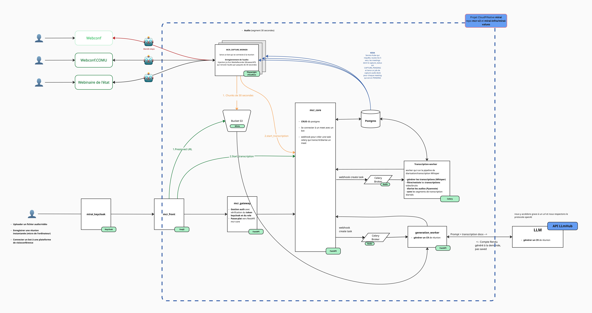

#### **1. Description**

Ce repository regroupe les différents services de l’application **FCR**, dont l’objectif est d’aider les métiers dans leurs tâches de génération de comptes rendus.

Les services sont les suivants :

1. **mcr-frontend**  
   Application **Vue**. Il s’agit de l’interface utilisateur de FCR.

2. **mcr-gateway**  
   Application **FastAPI** exposée comme point d’entrée du cluster.  
   Elle est en charge de l’**autorisation** des requêtes.

3. **mcr-core**  
   Application **FastAPI**. Module principal du backend.  
   Il orchestre la gestion des ressources (CRUD) ainsi que le **scheduling** des tâches de transcription.

4. **mcr-capture-worker**  
   Worker **Playwright** chargé de la capture audio des réunions en ligne.  
   Il utilise un bot simulant un utilisateur dans une réunion de visioconférence, capture l’audio à intervalles réguliers et l’envoie dans un bucket S3.

5. **mcr-transcription-worker**  
   Worker **Celery / Redis** en charge de la transcription et de la **diarisation** des fichiers audio.

6. **mcr-generation**  
   Worker **Celery / Redis** permettant de générer le compte rendu à partir de la transcription diarisation en entrée.

---

Il existe **trois manières** de fournir l’audio d’une réunion à FCR :

1. Via une plateforme de visioconférence (COMU, webinaire, webconf)
2. Via un fichier audio ou vidéo (MP3, WAV, MP4, etc.)
3. Via un microphone connecté à la machine

Une fois l’audio fourni, FCR effectue les étapes suivantes :

1. Transcription et diarisation de l’audio
2. Génération du compte rendu (optionnel)

---

### **2. Architecture de FCR**



---

### **3. Prérequis**

Un fichier `docker-compose` est disponible à la racine de ce repository.  
Il permet de faire fonctionner l’ensemble des briques applicatives en local.

Avant de démarrer, assurez-vous d’avoir installé les éléments suivants :

- [Docker](https://docs.docker.com/get-docker/)
- [Docker Compose](https://docs.docker.com/compose/install/)

De manière optionnelle, vous pouvez utiliser un outil de gestion de bases de données tel que :
- [pgAdmin](https://www.pgadmin.org/download/)
- [DBeaver](https://dbeaver.io/download/)

Ces outils permettent de visualiser et d’explorer le contenu de la base de données.

---

### **4. Lancement de FCR en local**

Clonez le repository et lancez le projet à l’aide de la commande `make` :

```bash
git clone git@github.com:IA-Generative/mcr.git
cd mcr
make start
```

---

### **5. Licence**
Ce projet est distribué sous licence Apache 2.0.

### **6. Avis de sécurité**

Tous les identifiants, noms d’utilisateurs, adresses e-mail, mots de passe et clés présents dans ce dépôt sont **des valeurs fictives**, utilisées **uniquement à des fins de développement local**.

Ils **ne correspondent à aucun environnement de production** et **ne permettent l’accès à aucun système réel**.