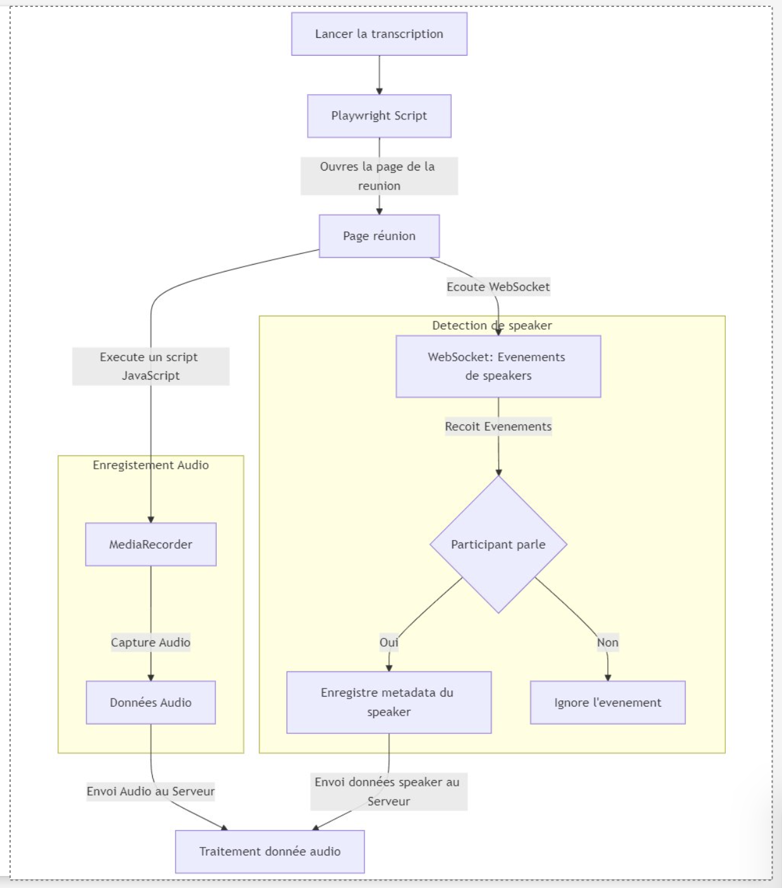

# MCR-Core

## **Description du Projet**

MCR-Core est une API centrale permettant la capture audio en temps réel, le suivi des intervenants et la gestion des transcriptions de réunions. Cette solution offre également des fonctionnalités complètes de gestion des réunions, des participants et des utilisateurs, ainsi que la génération de rapports pour vos activités collaboratives.

---

## **Fonctionnalités**

- **Capture audio en temps réel et suivi des intervenants** : Capture l’audio de réunion en temps réel et suit les prises de parole.
- **CRUD des réunions** : Ajout, modification, suppression et consultation des informations des réunions.
- **Liste des membres de réunion** : Gestion complète des participants d’une réunion.
- **Gestion des participants (à l’échelle globale)** : Base de données partagée des participants utilisables dans différentes réunions.
- **CRUD des utilisateurs** : Gestion des utilisateurs avec leurs rôles et permissions.
- **Gestion des transcriptions des réunions** : Upload et téléchargement des transcriptions de réunion.
- **Génération de rapports** : Construction de requêtes et appel à une API de génération de rapports.

---

## **Architecture**

### **Technologies Utilisées**

- **Backend** : FastAPI
- **Gestion des conteneurs** : Docker et Docker Compose
- **Base de données** : PostgreSQL
- **Capture audio** : Playwright

### **Workflow**

1. Ajout des informations d'une réunion (titre, date, etc.).
2. Gestion des participants et des membres de la réunion.
3. Capture audio en temps réel et suivi des intervenants.
4. Génération et gestion des transcriptions.
5. Construction et appel des rapports de réunion.

---

## **Installation**

### **Prérequis**

- Python 3.11+
- Pydantic 2.8.2
- Docker et Docker Compose
- Playwright et ses dépendances

Se réferer au repo https://github.com/IA-Generative/mcr.

## **Limitations Connues**

- L'api ne permet la connexion qu'aux réunions de la plateforme de visioconférence COMU
- Le script de récolte des speakers (évenements speaking) des reunions semble buguer lorsqu'un locuteur parle pour une durée qui dépasse 1m30
- L'application ne permet que la captation d'une reunion à la fois (playwright crash ?)
- Lorsque la transcription dépasse 10 pages le traitement de l'api de generation prend du temps ce qui peut des fois déclencher un timeout

## **Fonctionnement de la Captation Audio et Suivi des Intervenants**

### **Captation Audio avec Playwright**

La captation audio en temps réel est effectuée à l'aide de [Playwright](https://playwright.dev/), un outil puissant permettant l'automatisation des navigateurs. Voici les étapes principales du fonctionnement :

1. **Initialisation du navigateur** :
   - Un navigateur sans interface (headless) est lancé pour minimiser les ressources utilisées.
2. **Connexion à la réunion** :
   - Le navigateur accède à l'URL de la réunion et interagit avec l'interface pour se connecter comme un participant.
3. **Capture du flux audio** :

   - Une fois connecté, Playwright intercepte le flux audio du navigateur. Ce flux est segmenté en morceaux de 30 secondes pour faciliter le traitement et l'analyse.
   - Les segments audio sont sauvegardés temporairement sur le serveur ou transmis directement pour transcription.

4. **Résilience** :
   - En cas de déconnexion ou de problème réseau, un mécanisme de reprise assure la continuité de la capture audio.

### **Suivi des Intervenants avec WebSocket**

Le suivi des intervenants est réalisé en temps réel grâce à un protocole **WebSocket**, permettant une communication bidirectionnelle entre le serveur et les clients connectés. Voici les principales étapes :

1. **Connexion WebSocket** :

   - Lorsqu'une réunion est en cours, un serveur WebSocket écoute les événements transmis par les clients (par exemple, les navigateurs des participants).

2. **Détection des prises de parole** :

   - Chaque événement contient les informations suivantes :
     - `speaker_id` : l'identifiant de l'intervenant.
     - `speaking` : un indicateur booléen précisant si l'intervenant parle.
     - `audioMuted` : un indicateur précisant si le microphone de l'intervenant est activé ou désactivé.

3. **Filtrage des événements** :

   - Seuls les événements indiquant un changement de statut de parole (`speaking`) sont pris en compte.
   - Les événements liés à la désactivation ou à l'activation du microphone (`audioMuted`) sont ignorés pour éviter les faux positifs.

4. **Association avec le flux audio** :

   - Les informations des intervenants sont synchronisées avec les segments audio capturés. Cela permet d'identifier qui parle dans chaque segment audio.

5. **Traitement en temps réel** :
   - Les événements sont traités immédiatement pour garantir que les informations des intervenants soient disponibles dans les transcriptions et les rapports générés.

