# Audio processing pipeline — `mcr-core`

The audio processing pipeline turns the raw audio chunks recorded for a meeting (stored on S3/Minio by `mcr-capture-worker`) into a clean, speaker-labelled transcription. It runs inside the **transcription Celery worker** (`transcription_worker.py`), not the HTTP API: a `transcribe` task is dispatched for a `meeting_id`, the pipeline produces a list of `SpeakerTranscription`, and the worker POSTs the result back to the meeting API which flips the meeting to `TRANSCRIPTION_DONE`.

The orchestration is owned by `SpeechToTextPipeline` (`app/services/speech_to_text/speech_to_text.py`), wrapped by `transcribe_meeting` (`app/services/meeting_to_transcription_service.py`).

## Input / Output

| | Type | Description |
|---|---|---|
| **In** `meeting_id` | `int` | Meeting identifier. Used to list and download the audio chunks under the S3 prefix `{meeting_id}/`. |
| **In** *(implicit)* audio chunks | S3 objects | Recorded audio fragments uploaded by `mcr-capture-worker`, concatenated into a single byte stream before processing. |
| **Out** | `list[SpeakerTranscription]` | Ordered, speaker-attributed transcription segments (`meeting_id`, `transcription_index`, `speaker`, `transcription`, `start`, `end`). Serialized and POSTed back to `mcr-core`. |

The pipeline is **two-stage by nature**: *pre-transcription* (turn arbitrary audio into clean, normalized speech that the models can read) and *post-transcription* (turn raw model output into a polished, human-readable transcript). The audio models (diarization + transcription) sit in between.

## Pipeline diagram

```mermaid
flowchart TB
    accTitle: MCR audio processing pipeline
    accDescr {
      Flow of the transcribe Celery task: download and concatenate audio
      chunks from S3, pre-process (normalize, silence check, optional noise
      filtering), diarize speakers, chunk by silence, transcribe, align
      transcription with speakers, post-process (merge, de-hallucinate,
      acronym + spelling correction), name participants, return segments.
    }

    classDef io fill:#e1f5ff,stroke:#0277bd,color:#01579b
    classDef proc fill:#f3e5f5,stroke:#6a1b9a,color:#4a148c
    classDef model fill:#fce4ec,stroke:#ad1457,color:#880e4f
    classDef llm fill:#fff3e0,stroke:#e65100,color:#bf360c
    classDef out fill:#e8f5e9,stroke:#2e7d32,color:#1b5e20

    %% Entry
    IN[/"meeting_id"/]:::io
    IN --> TASK["transcribe (Celery task)<br/>→ transcribe_meeting()"]:::proc

    %% Fetch
    subgraph FETCH_G["Fetch audio"]
      direction TB
      S3[("S3 / Minio<br/>prefix {meeting_id}/")]:::io
      CAT["download_and_concatenate_<br/>s3_audio_chunks_into_bytes()"]:::proc
      S3 -->|"chunks"| CAT
    end
    TASK --> CAT

    %% Pre-process
    subgraph PRE["Pre-process (pre_process)"]
      direction TB
      WAV["audio_bytes_to_wav_bytes()<br/>FFmpeg → WAV 16kHz mono"]:::proc
      SIL["check_audio_is_not_silent()<br/>silencedetect, abs −40dB floor"]:::proc
      NOISY{"is_audio_noisy()<br/>spectral flatness on silences"}:::proc
      FILT["filter_noise_from_audio_bytes()<br/>FFmpeg NOISE_FILTERS chain"]:::proc
      WAV --> SIL --> NOISY
      NOISY -->|"flatness &gt; 0.05<br/>(flag on)"| FILT
      NOISY -->|"clean / flag off"| CLEAN[/"normalized WAV"/]:::io
      FILT --> CLEAN
    end
    CAT --> WAV
    SIL -.->|"≥95% silent"| ERR["SilentAudioError"]:::proc

    %% Diarization
    subgraph DIA["Diarization (DiarizationProcessor)"]
      direction TB
      DSW{"API_BASED_DIARIZATION?"}:::proc
      DLOC["pyannote speaker-diarization-3.1<br/>(local model)"]:::model
      DAPI["diarization API<br/>(remote)"]:::model
      DSW -->|"off"| DLOC
      DSW -->|"on"| DAPI
      DSEG[/"list&lt;DiarizationSegment&gt;<br/>start, end, LOCUTEUR_NN"/]:::out
      DLOC --> DSEG
      DAPI --> DSEG
    end
    CLEAN --> DSW
    DSEG -.->|"empty"| EMPTY[/"return []"/]:::out

    %% Chunking
    CHUNK["compute_transcription_chunks()<br/>merge overlaps + greedy split<br/>on silence (≤600s)"]:::proc
    DSEG --> CHUNK
    CHUNK --> SPANS[/"list&lt;TimeSpan&gt;"/]:::io

    %% Transcription
    subgraph TR["Transcription (TranscriptionProcessor)"]
      direction TB
      SPLIT["split_audio_on_timestamps()<br/>slice WAV per span"]:::proc
      TSW{"API_BASED_TRANSCRIPTION?"}:::proc
      TLOC["faster-whisper large-v3-turbo<br/>(local model)"]:::model
      TAPI["transcription API<br/>(OpenAI-compatible)"]:::model
      SPLIT --> TSW
      TSW -->|"off"| TLOC
      TSW -->|"on"| TAPI
    end
    CLEAN --> SPLIT
    SPANS --> SPLIT
    TLOC --> TSEG[/"list&lt;TranscriptionSegment&gt;"/]:::out
    TAPI --> TSEG

    %% Alignment
    ALIGN["diarize_vad_transcription_segments()<br/>assign speaker by max time overlap"]:::proc
    TSEG --> ALIGN
    DSEG --> ALIGN
    ALIGN --> DTS[/"list&lt;DiarizedTranscriptionSegment&gt;"/]:::out

    %% Post-process
    subgraph POST["Post-process (post_process)"]
      direction TB
      MERGE["merge_consecutive_segments_per_speaker()"]:::proc
      HALL["remove_hallucinations()<br/>strip FORBIDDEN_SENTENCES"]:::proc
      ACR["AcronymCorrector.correct()<br/>LLM + glossary (always)"]:::llm
      SPELL["SpellingCorrector.correct()<br/>LLM (flag: spelling_correction)"]:::llm
      MERGE --> HALL --> ACR --> SPELL
    end
    DTS --> MERGE

    %% Participants
    PART["enrich_segments_with_participants()<br/>ParticipantExtraction (init+refine LLM)<br/>→ replace LOCUTEUR_NN with names"]:::llm
    SPELL --> PART

    %% Output
    OUT[/"list&lt;SpeakerTranscription&gt;"/]:::out
    PART --> OUT
    OUT --> BACK["POST mark_transcription_as_success<br/>→ mcr-core (TRANSCRIPTION_DONE)"]:::proc
```

## Reading the diagram

| Color | Meaning |
|---|---|
| 🟦 Blue (`io`) | Data flowing through (input, S3 objects, intermediate lists/spans) |
| 🟪 Purple (`proc`) | Pure Python / FFmpeg signal processing — no model or LLM call |
| 🟥 Pink (`model`) | Audio ML inference: pyannote (diarization) or Whisper (transcription), local or via API |
| 🟧 Orange (`llm`) | Step that calls an LLM via `instructor` against the LLM hub (costs time and tokens) |
| 🟩 Green (`out`) | Final or stable intermediate structured object |

Note the distinction between 🟥 **model** and 🟧 **llm**: diarization and transcription are dedicated audio models; the acronym/spelling/participant steps are general-purpose LLM calls (OpenAI-compatible LLM hub through `instructor`, JSON mode).

## Stage-by-stage

### 1. Fetch & concatenate audio
`download_and_concatenate_s3_audio_chunks_into_bytes` lists every object under the `{meeting_id}/` prefix and concatenates them into one `BytesIO`. Raises `NoAudioFoundError` when no chunk exists, `InvalidAudioFileError` on a download failure.

### 2. Pre-process (`SpeechToTextPipeline.pre_process`)
The goal is to hand the models a single, predictable signal regardless of the source codec/container.

| Step | Function | What it does |
|---|---|---|
| Normalize | `audio_bytes_to_wav_bytes` | FFmpeg transcode to WAV at **16 kHz, mono** (`AudioSettings`). Input is staged to a temp file because FFmpeg cannot seek on stdin — critical for formats (m4a/mp4) whose metadata lives at the end. |
| Silence guard | `check_audio_is_not_silent` | `silencedetect` with a **fixed absolute floor** (`SILENT_AUDIO_NOISE_FLOOR_DB = −40 dB`); if the silence ratio ≥ `SILENT_AUDIO_THRESHOLD` (0.95) it raises `SilentAudioError`. The absolute floor (vs. the relative one used elsewhere) is what makes detection reliable on fully-silent audio. |
| Noise detection | `is_audio_noisy` | Gated by the `audio_noise_filtering` feature flag. Runs a two-pass EBU R128 `loudnorm`, detects silences with a **relative** threshold (`mean_volume − SILENCE_THRESHOLD_OFFSET_DB`, i.e. −10 dB), then computes **spectral flatness** (geometric mean / arithmetic mean of the FFT power spectrum) over the silent frames. Flatness `> NOISE_FLATNESS_THRESHOLD` (0.05) → noisy. No silence found → assumed noisy. |
| Noise filtering | `filter_noise_from_audio_bytes` | Only if detected noisy. Applies the `Speech2TextSettings.NOISE_FILTERS` FFmpeg chain: highpass → `afftdn` denoise → noise gate → two equalizers (cut rumble ~250 Hz, lift presence ~3.5 kHz) → compressor → `loudnorm`. |

### 3. Diarization (`DiarizationProcessor.diarize`)
Answers *who spoke when* (independently of *what* was said). Output is `list[DiarizationSegment]` with `start`, `end`, and a French-formatted speaker label (`SPEAKER_03` → `LOCUTEUR_03` via `convert_to_french_speaker`).

- **Local** (default): pyannote `speaker-diarization-3.1`, loaded once into the Celery worker context (or freshly in `DEV`).
- **API** (`API_BASED_DIARIZATION` flag): POSTs the WAV to a remote diarization endpoint with `min_duration_off=1.5` and `clustering_threshold=0.65` (`PyannoteDiarizationParameters`).

If diarization returns nothing, the whole pipeline short-circuits and returns `[]`.

### 4. Chunking (`compute_transcription_chunks`)
Whisper degrades on very long inputs, so speech is cut into chunks of **at most `MAX_CHUNK_DURATION` (600 s ≈ 10 min)**. Overlapping diarization segments are merged into non-overlapping intervals, then greedily accumulated; when a chunk would exceed the limit, the split is placed at the **midpoint of the largest silence gap** in the last `SPLIT_SEARCH_WINDOW_RATIO` (20 %) of the chunk — falling back to a hard cut if no gap exists. Cutting on silence avoids slicing through a word. Output is `list[TimeSpan]`.

### 5. Transcription (`TranscriptionProcessor.transcribe`)
`split_audio_on_timestamps` slices the normalized WAV into per-span mono float32 arrays, then each chunk is transcribed and its segment timestamps are offset back by the chunk start.

- **Local** (default): `faster-whisper large-v3-turbo`, `language=fr`, word timestamps on, with an `INITIAL_PROMPT` that primes the model toward fluent meeting prose.
- **API** (`API_BASED_TRANSCRIPTION` flag): OpenAI-compatible `audio.transcriptions` with `response_format="verbose_json"`.

Output is `list[TranscriptionSegment]` (`id`, `start`, `end`, `text`) — no speaker yet.

### 6. Alignment (`diarize_vad_transcription_segments`)
Marries the two model outputs: each transcription segment is assigned the diarization speaker with the **maximum time overlap**. Segments entirely outside the diarization range are dropped; a matched-but-unlabelled span becomes `INCONNU_{id}`; an empty diarization yields blank speakers. Output is `list[DiarizedTranscriptionSegment]` (adds `speaker`).

### 7. Post-process (`SpeechToTextPipeline.post_process`)
Turns raw model output into a readable transcript. Raises `InvalidAudioFileError` if there are no segments.

| Step | Function | What it does |
|---|---|---|
| Merge | `merge_consecutive_segments_per_speaker` | Collapses adjacent same-speaker segments into one turn (`groupby`), re-indexing ids. |
| De-hallucinate | `remove_hallucinations` | Regex-strips known Whisper hallucinations (`TranscriptionForbiddenSentences.FORBIDDEN_SENTENCES`, e.g. *"Sous-titrage Société Radio-Canada"*), normalizes whitespace, drops empties. **Order matters** — longer patterns are listed first so a substring pattern doesn't shadow them. |
| Acronym correction | `AcronymCorrector.correct` | **Always on.** LLM rewrite using a domain glossary (`correct_acronyms/`). |
| Spelling correction | `SpellingCorrector.correct` | Gated by the `spelling_correction` flag. Chunks the dialogue with `<separatorN>` markers, sends each chunk to the LLM, then re-splits on the markers and replaces text per segment (keeping the original when a separator goes missing — see `_invalidate_missing_separators`). |

Both correctors extend `LLMPostProcessing` (`app/services/llm_post_processing.py`): `instructor`-wrapped OpenAI client in JSON mode against the LLM hub, with `RecursiveCharacterTextSplitter` chunking (`ChunkingConfig`: 20000 chars, 100 overlap).

### 8. Participant naming (`enrich_segments_with_participants`)
Back in `transcribe_meeting`. `ParticipantExtraction` (also an `LLMPostProcessing`) runs an **init-then-refine** loop — seed `Participant` list from the first chunk, refine across subsequent chunks — to deduce each speaker's real name/role/confidence from the dialogue. `replace_speaker_name_if_available` then swaps `LOCUTEUR_NN` for the deduced name where confidence allows. This whole step is wrapped in a `try/except`: if naming fails, the pipeline keeps the `LOCUTEUR_NN` labels rather than failing the transcription. Name losses between refine steps are logged and recorded to Langfuse (`record_participant_name_lost_event`).

## Feature flags

The pipeline branches on four flags (`feature_flag_service`). Defaults reflect the self-hosted/local path.

| Flag | Default | Effect when on |
|---|---|---|
| `audio_noise_filtering` | off | Run noise detection and conditionally apply the FFmpeg noise chain in pre-processing. |
| `API_BASED_DIARIZATION` | off | Use the remote diarization API instead of the local pyannote model. |
| `API_BASED_TRANSCRIPTION` | off | Use the remote OpenAI-compatible transcription API instead of local faster-whisper. |
| `spelling_correction` | off | Run the LLM spelling-correction pass in post-processing. |

## Going further

Pointers to the key files:

- **Orchestrator**: `app/services/speech_to_text/speech_to_text.py` — `SpeechToTextPipeline.run` (pre_process → diarize → chunk → transcribe → align → post_process).
- **Entry point**: `app/services/meeting_to_transcription_service.py` (`transcribe_meeting`) and `transcription_worker.py` (`transcribe` Celery task + success/failure signals).
- **Pre-transcription**: `app/services/audio_pre_transcription_processing_service.py` — normalization, silence/noise detection, FFmpeg filtering, S3 concatenation.
- **Diarization**: `app/services/speech_to_text/diarization_processor.py` (local vs API).
- **Chunking**: `app/services/speech_to_text/utils/chunking.py` (silence-aware split) and `utils/types.py` (`TimeSpan`).
- **Transcription**: `app/services/speech_to_text/transcription_processor.py` and `utils/audio.py` (slicing).
- **Alignment**: `app/services/speech_to_text/utils/vad.py` (`diarize_vad_transcription_segments`, speaker label conversion).
- **Post-process**: `app/services/speech_to_text/transcription_post_process.py` (merge + de-hallucinate).
- **LLM cleaning**: `app/services/llm_post_processing.py` (base), `correct_acronyms/`, `correct_spelling_mistakes/`, `speech_to_text/participants_naming/`.
- **Settings**: `app/configs/base.py` — `AudioSettings`, `NoiseDetectionSettings`, `NormalizedAudioVolumeSettings`, `PyannoteDiarizationParameters`, `WhisperTranscriptionSettings`, `Speech2TextSettings`, `TranscriptionApiSettings`, `TranscriptionForbiddenSentences`, `ChunkingConfig`, `LLMSettings`.
</content>
</invoke>
