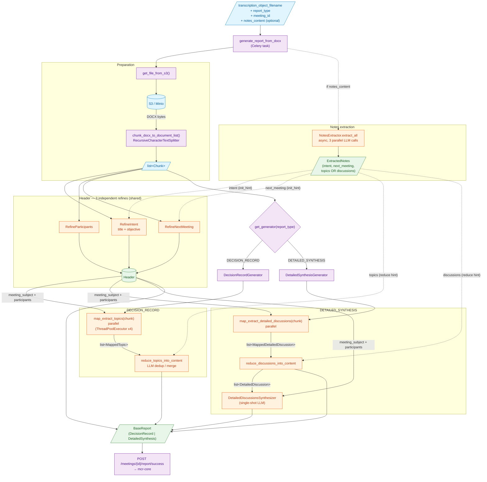
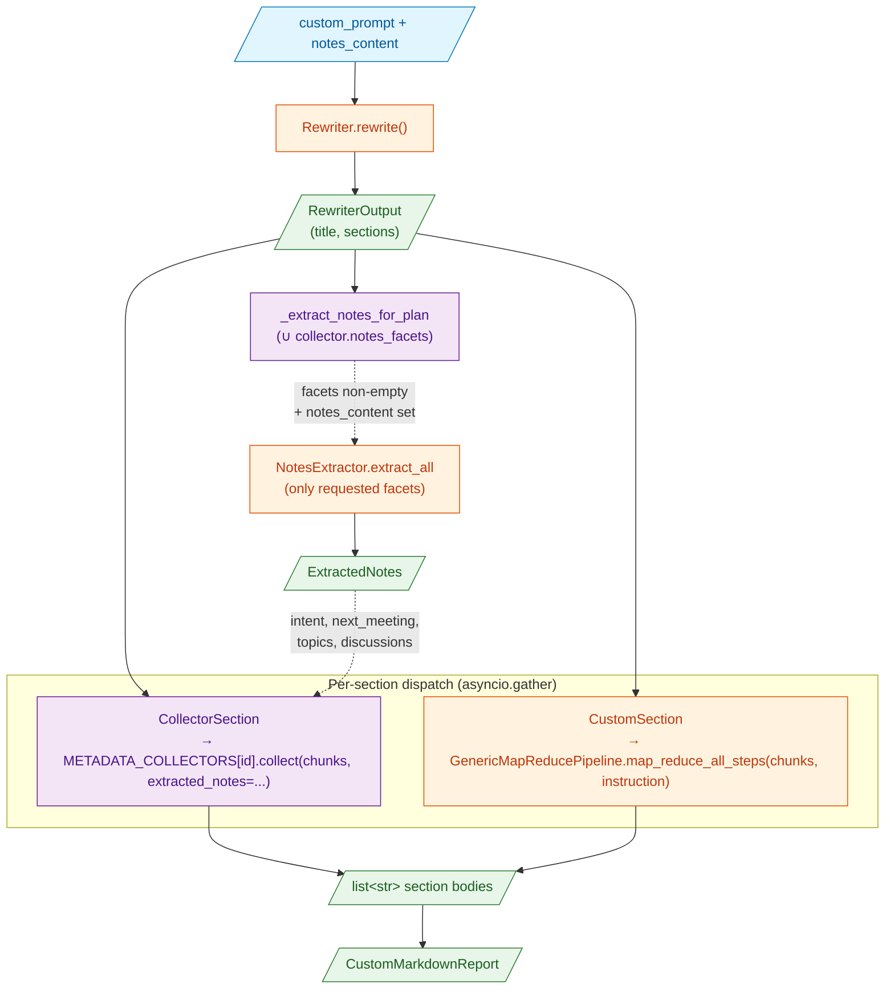

# Report generation pipeline — `mcr-generation`

The `mcr-generation` service is a Celery worker that turns a meeting transcript (DOCX stored on S3) into a structured Pydantic report, according to a requested report type. It exposes no HTTP API: it consumes Celery tasks dispatched by `mcr-core` and POSTs the result back.

## Input / Output

| | Type | Description |
|---|---|---|
| **In** `meeting_id` | `int` | Meeting identifier on the `mcr-core` side |
| **In** `transcription_object_filename` | `str` | S3 key of the transcription DOCX |
| **In** `report_type` | `ReportTypes` | `DECISION_RECORD`, `DETAILED_SYNTHESIS` or `CUSTOM_REPORT` |
| **In** `notes_content` | `str \| None` | Human-written notes taken during the meeting (optional). Extracted by `NotesExtractor` into structured hints — `intent` and `next_meeting` seed the corresponding refiners; `topics` and `discussions` are injected as a human-priority hint into the reduce step. For `CUSTOM_REPORT`, the facets actually extracted are the union of the `notes_facets` advertised by the `CollectorSection`s produced by the rewriter plan. |
| **In** `custom_prompt` | `str \| None` | End-user instruction. Required for `CUSTOM_REPORT`, ignored for the structured types. |
| **Out** | `BaseReport \| CustomMarkdownReport` | `DecisionRecord`, `DetailedSynthesis` (Pydantic) or `CustomMarkdownReport` (raw markdown). |

## Pipeline diagram

## Reading the diagram

| Color | Meaning |
|---|---|
| 🟦 Blue (`io`) | Data flowing through (input/output, S3 file, list of chunks) |
| 🟪 Purple (`proc`) | Pure Python step (no LLM call) |
| 🟧 Orange (`llm`) | Step that calls an LLM via `instructor` (costs time and tokens) |
| 🟩 Green (`out`) | Final or stable intermediate structured object |

## The three extraction strategies

| Strategy | Where | How it works | Why this choice |
|---|---|---|---|
| **Sequential refine** (no map) | Header (Intent, Participants, NextMeeting) | First chunk seeds the object; each subsequent chunk iteratively refines the same object via one LLM call. When notes are provided, `extracted_notes.intent` and `extracted_notes.next_meeting` replace the initial LLM extract as the seed: the refine loop then runs over **every** chunk against that notes-derived seed, saving one LLM call and grounding subsequent refines on what the notes author explicitly wrote. | The header is a single coherent object (one title, one participant list): we enrich it progressively rather than aggregating fragments. |
| **Parallel map-reduce** | Content (Topics, DetailedDiscussions) | Map: one LLM call per chunk in parallel (ThreadPoolExecutor, 4 workers) extracts candidate items. Reduce: one final LLM call dedupes and merges. When notes are provided, the corresponding `extracted_notes.topics` / `extracted_notes.discussions` is injected into the reduce prompt as a **human-priority signal**: the transcription remains the primary source but the notes take precedence on direct contradictions, and a topic absent from notes is not invalidated (notes are not exhaustive). The map phase is untouched. The reduce span is `section_topics_reduce` / `section_discussions_reduce` in Langfuse (rebranded from the previous shared `section_content_*` to disambiguate). | Content is inherently multi-item (multiple topics, multiple discussions): we parallelise extraction and let the LLM handle final coherence. |
| **Single-shot synthesis** | DETAILED_SYNTHESIS only (`DetailedDiscussionsSynthesizer`) | One LLM call over the consolidated `Content` to produce `discussions_summary`, `to_do_list`, `to_monitor_list`. | These outputs are derivatives of already-reduced content — no need to revisit raw chunks. |

## Custom report flow

The `CUSTOM_REPORT` branch follows a different shape: the report structure itself is decided at runtime by a `Rewriter` LLM call that turns the raw user prompt into a `RewriterOutput` plan (an ordered list of `SectionSpec`s, each either a `CollectorSection` or a `CustomSection`).

The orchestrator (`CustomReportGenerator`) serialises `rewriter → notes extraction` because the set of facets to extract is unknown until the plan exists. If the plan contains only `CustomSection`s, or only `CollectorSection`s whose `notes_facets` are empty (e.g. `participants` alone), no `NotesExtractor` call is issued. `CustomSection`s currently render without notes hints — wiring them in is tracked separately.

Each `MetadataCollector` advertises a `notes_facets: ClassVar[frozenset[NotesFacet]]` so the orchestrator can compute the union without inspecting collector internals:

| Collector | `notes_facets` | Wired-in hints |
|---|---|---|
| `title` | `{INTENT}` | `RefineIntent.init_hint = notes.intent` |
| `next_meeting` | `{NEXT_MEETING}` | `RefineNextMeeting.init_hint = notes.next_meeting` |
| `topics` | `{INTENT, TOPICS}` | inner `RefineIntent.init_hint = notes.intent`, `MapReduceTopics.notes_hint = notes.topics` |
| `detailed_discussions` | `{INTENT, DISCUSSIONS}` | inner `RefineIntent.init_hint = notes.intent`, `MapReduceDetailedDiscussions.notes_hint = notes.discussions` |
| `participants` | `∅` | none — notes are not used here |

## Going further

Pointers to key files if you want to dive into the code:

- **Celery task**: `app/services/report_generation_task_service.py` — entry point + success/failure handlers that POST back to `mcr-core`.
- **Generator factory**: `app/services/report_generator/__init__.py` — dispatch via `match` on `ReportTypes`.
- **Base class + shared header**: `app/services/report_generator/base_report_generator.py`.
- **Map-reduce**: `app/services/sections/topics/map_reduce_topics.py`, `app/services/sections/detailed_discussions/map_reduce_detailed_discussions.py`.
- **Refine**: `app/services/sections/base/init_then_refine.py` defines the generic `BaseInitThenRefine[T]` that owns the loop, prompt rendering and Langfuse span. `init_then_refine(chunks, init_hint=None)` accepts an optional `init_hint`: when set, the initial LLM extract on `chunks[0]` is skipped and the seed is `init_hint` itself, then every chunk is refined against it. The three concrete refiners (`app/services/sections/{intent,participants,next_meeting}/refine_*.py`) only declare four class attributes (`response_model`, two prompt templates, `section_name`). `RefineParticipants` returns an internal chain-of-thought wrapper; `BaseReportGenerator.generate_header` finalises it via `.to_public()`.
- **Shared LLM client**: `app/services/utils/llm_helpers.py` — `call_llm_with_structured_output()` (Instructor + exponential retry + Langfuse observability).
- **Output schemas**: `app/schemas/base.py` (`BaseReport`, `DecisionRecord`, `DetailedSynthesis`, `Header`).
